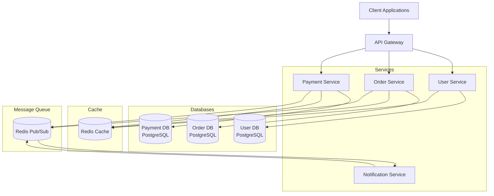

```mermaid
graph TB
    Client[Client Applications]
    ApiGw[API Gateway]

    subgraph Services
        UserSvc[User Service]
        OrderSvc[Order Service]
        PaySvc[Payment Service]
        NotifSvc[Notification Service]
    end
    
    subgraph Databases
        UserDB[(User DB<br/>PostgreSQL)]
        OrderDB[(Order DB<br/>PostgreSQL)]
        PayDB[(Payment DB<br/>PostgreSQL)]
    end
    
    subgraph Cache
        RedisCache[(Redis Cache)]
    end
    
    subgraph Message Queue
        Queue[(Redis Pub/Sub)]
    end
    
    Client --> ApiGw
    ApiGw --> UserSvc
    ApiGw --> OrderSvc
    ApiGw --> PaySvc
    
    UserSvc --> UserDB
    OrderSvc --> OrderDB
    PaySvc --> PayDB
    
    UserSvc --> RedisCache
    OrderSvc --> RedisCache
    PaySvc --> RedisCache
    
    OrderSvc --> Queue
    PaySvc --> Queue
    Queue --> NotifSvc
    
    NotifSvc --> Queue
```
